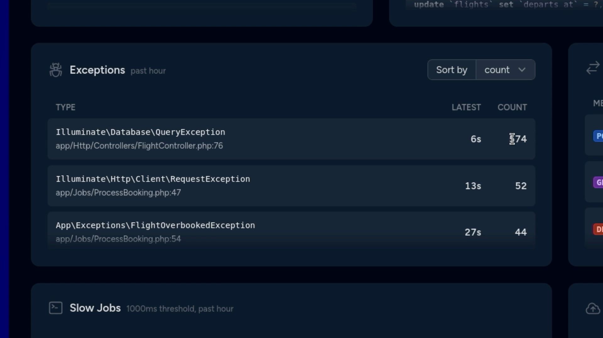
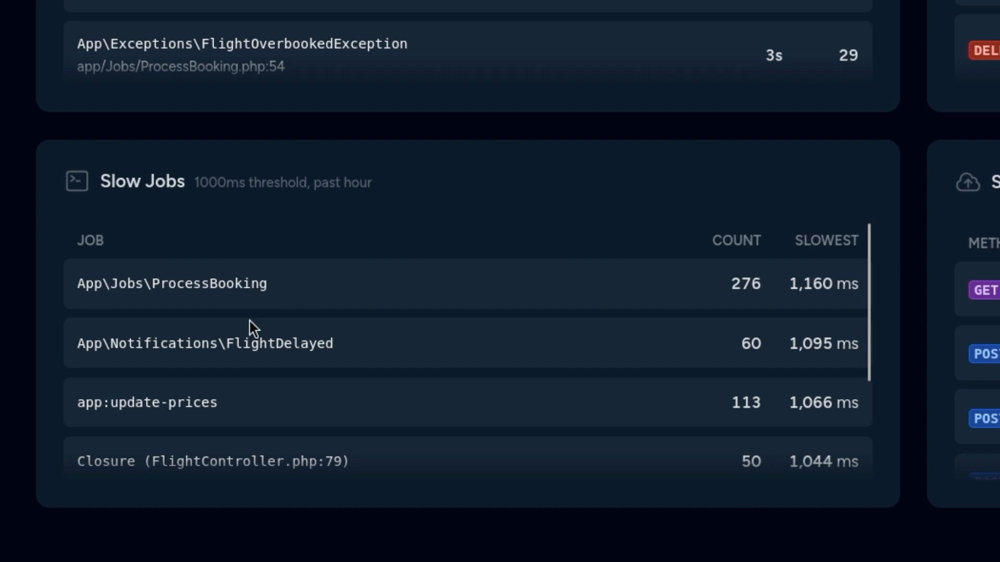

## Custom Laravel Pulse Card`s 

If you never heard about it, Laravel Pulse is a free and open source package for the Laravel framework that helps developers monitor various aspects of their web applications in real-time.

Laravel Pulse also allows developers to create what’s called a “custom card,” which will help populate the dashboard with useful data for your application. Let’s talk about the best ones I’ve found in alphabetical order.


### Following are custom cards for Laravel Pulse:-

## User Requests :- 
The UserRequests recorder captures information about the users making requests to your application for display on the Application Usage card.

## Insights Database :- 
Get real-time insights into the status of your database.This is a card that will give you real-time insights about your databases such as the active threads, the current amount of connections, and more!

## Slow Queries :-
 Card shows the database queries in your application that exceed the configured threshold, which is 1,000ms by default. 

## Slow Requests :-
The Requests recorder captures information about requests made to your application for display on the Slow Requests and Application Usage cards.

## Slow Outgoing Requests :-
card shows outgoing requests made using Laravel's HTTP client that exceed the configured threshold, which is 1,000ms by default.

## Scheduled Tasks :- 
Laravel Pulse card that list all scheduled tasks.This is a card that will list all your scheduled tasks as well as the next time they will run.
card shows the throughput of the queues in your application, including the number of jobs queued, processing, processed, released, and failed. 

## Slow Jobs :-
Card shows the queued jobs in your application that exceed the configured threshold, which is 1,000ms by default.

## Exceptions :- 
Card shows the frequency and recency of exceptions occurring in your application.

## Cache :-
Card shows the cache hit and miss statistics for your application, both globally and for individual keys.

## Track 404 errors :- 
is a card that will track dead links on your website. It’s a great way to make sure your users don’t repeatedly end up on non-existing page ever again.


## Installation

1. Clone the repository:

    ```bash
   https://github.com/asifmulla7/Custom-Laravel-Pulse-Cards.git
    ```

2. Install PHP dependencies:

    ```bash
    composer install
    ```

3. Install Node.js dependencies:

    ```bash
    npm install
    ```
4. At last, built bootstrap CSS using the below command:

    ```bash
    npm run build
    ```           
5. Copy the `.env.example` file to `.env` and configure your environment variables:

    ```bash
    cp .env.example .env
    ```    

6. Generate application key:

    ```bash
    php artisan key:generate
    ```


7. Run migrations and seed the database:

    ```bash
    php artisan migrate --seed
    ```

8. Serve the application:

    ```bash
    php artisan serve
    ```
## Following are the screenshort for reference 

### 1 . User Requests / Slow Queries / Cache
 
 
### 2 . Insights Database
.jpeg>)

### 3 . Slow Requests


### 4 . Slow Outgoing Requests


### 5 . Exceptions


### 6 .Slow Jobs



And that's it! Enjoy enhanced visibility of all activities on your Pulse dashboard.
